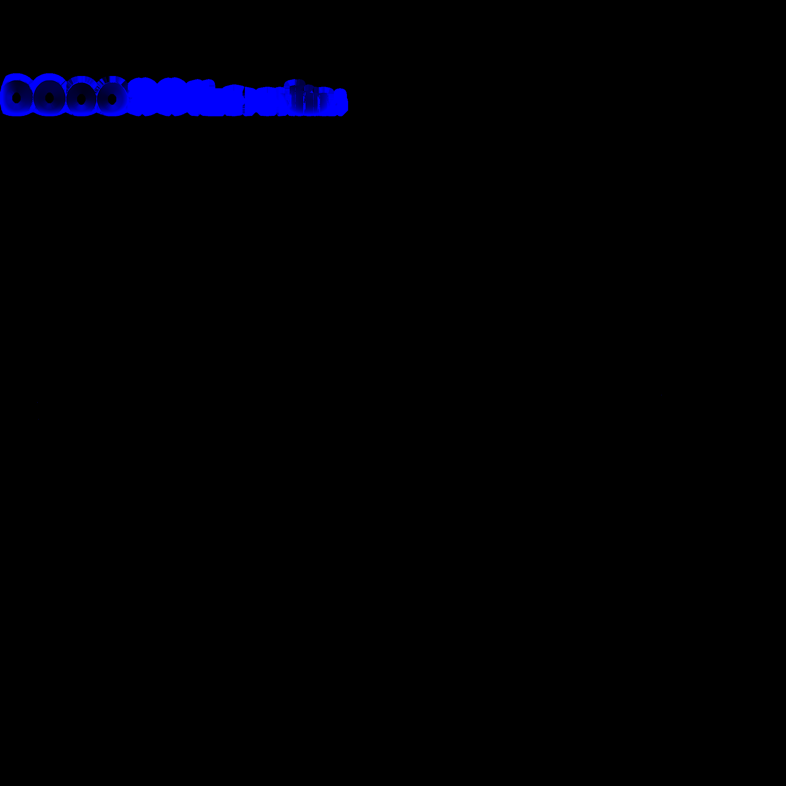

# Universal Image Packer (UIP)

Universal Image Packer is an open source desktop tool for texture channel extraction and packing.  
You use it to extract RGBA channels or create engine ready packed textures from grayscale maps.

Built for artists and technical artists working with real time pipelines.

## Features

- Extract individual colour channels from any RGBA image
- Pack multiple grayscale maps into a single texture
- Supports Unity and engine neutral layouts
- Reduces texture count and memory use

## Unity Texture Packer

<table>
<tr>
<td width="55%">

Inputs:
- Metalness  
- Ambient Occlusion  
- Detail  
- Smoothness  

Output layout:

| Channel | Map |
|--------|-----|
| Red | Metalness |
| Green | Ambient Occlusion |
| Blue | Detail |
| Alpha | Smoothness |

Invert Smoothness:
- Inverts black and white values of the map.
- This lets you use roughness maps not created for Unity.

</td>
<td width="45%" align="center">

</td>
</tr>
</table>

## AORM Packer

<table>
<tr>
<td width="55%">

Inputs:
- Ambient Occlusion  
- Roughness  
- Metalness  

Output layout:

| Channel | Map |
|--------|-----|
| Red | Ambient Occlusion |
| Green | Roughness |
| Blue | Metalness |

</td>
<td width="45%" align="center">

</td>
</tr>
</table>

## Channel Extractor

<table>
<tr>
<td width="55%">

- Open an image
- Export individual channels
  - Red
  - Green
  - Blue
  - Alpha

</td>
<td width="45%" align="center">

</td>
</tr>
</table>

## Notes

- You do not need to load all possible inputs to build a map.
- All input images must share the same resolution.
- Currently built windows only (.exe).
